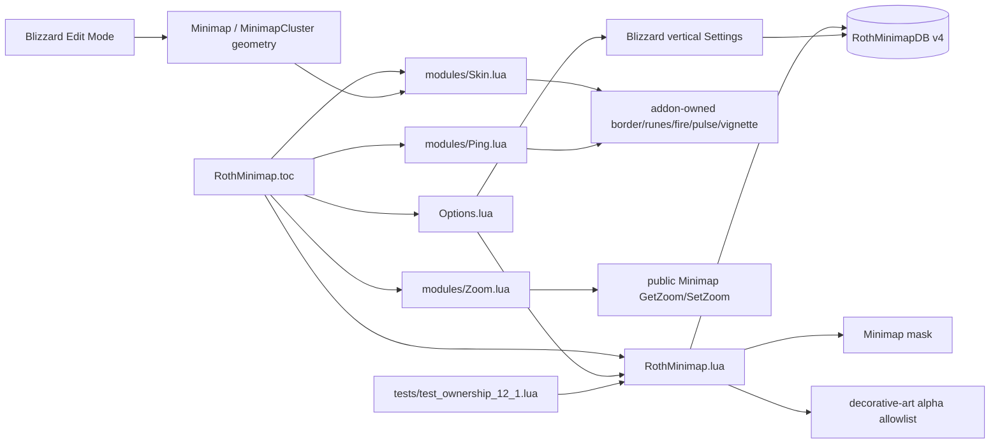

# Roth Minimap code graph

```mermaid
flowchart LR
  T["RothMinimap.toc"] --> C["RothMinimap.lua"]
  T --> S["modules/Skin.lua"]
  T --> P["modules/Ping.lua"]
  T --> Z["modules/Zoom.lua"]
  T --> O["Options.lua"]
  C --> DB[("RothMinimapDB v4")]
  E["Blizzard Edit Mode"] --> M["Minimap / MinimapCluster geometry"]
  M --> S
  C --> MASK["Minimap mask"]
  C --> ART["decorative-art alpha allowlist"]
  S --> OWN["addon-owned border/runes/fire/pulse/vignette"]
  P --> OWN
  Z --> PUB["public Minimap GetZoom/SetZoom"]
  O --> SET["Blizzard vertical Settings"]
  SET --> DB
  O --> C
  X["tests/test_ownership_12_1.lua"] --> C
```

Clock, calendar, tracking, difficulty, mail, queues, Addon Compartment, and native/third-party minimap buttons have no ownership edge from RothMinimap.
