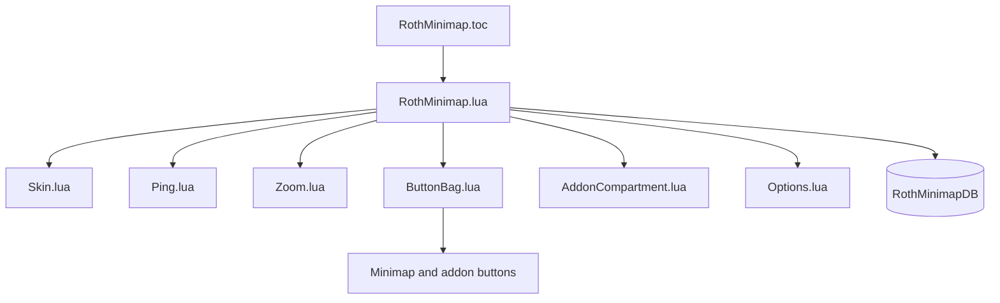

# Roth Minimap code graph

```mermaid
flowchart TD
  T["RothMinimap.toc"] --> R["RothMinimap.lua"]
  R --> S["Skin.lua"]
  R --> P["Ping.lua"]
  R --> Z["Zoom.lua"]
  R --> B["ButtonBag.lua"]
  R --> A["AddonCompartment.lua"]
  R --> O["Options.lua"]
  B --> M["Minimap and addon buttons"]
  R --> DB[("RothMinimapDB")]
```
