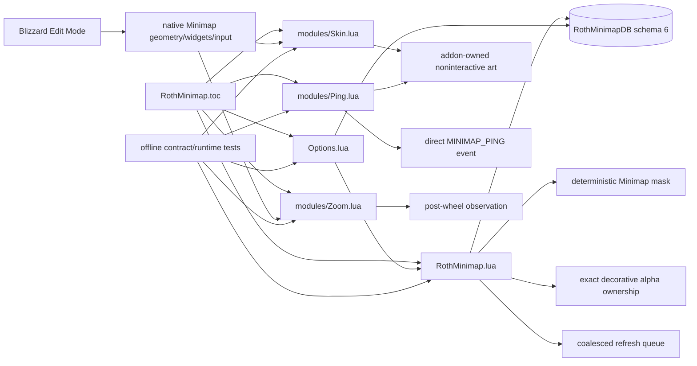

# Roth Minimap code graph

```mermaid
flowchart LR
  T["RothMinimap.toc"] --> C["RothMinimap.lua"]
  T --> S["modules/Skin.lua"]
  T --> P["modules/Ping.lua"]
  T --> Z["modules/Zoom.lua"]
  T --> O["Options.lua"]

  C --> DB[("RothMinimapDB schema 6")]
  C --> MASK["deterministic Minimap mask"]
  C --> ART["exact decorative alpha ownership"]
  C --> Q["coalesced refresh queue"]

  E["Blizzard Edit Mode"] --> N["native Minimap geometry/widgets/input"]
  N --> S
  N --> Z

  S --> OWN["addon-owned noninteractive art"]
  P --> OWN
  P --> MP["direct MINIMAP_PING event"]
  Z --> W["post-wheel observation"]
  O --> DB
  O --> C

  X["offline contract/runtime tests"] --> C
  X --> S
  X --> P
  X --> Z
  X --> O
```

There is no Roth Minimap ownership edge to native/third-party buttons, functional `MinimapBackdrop` descendants, or `MinimapCluster` geometry.
