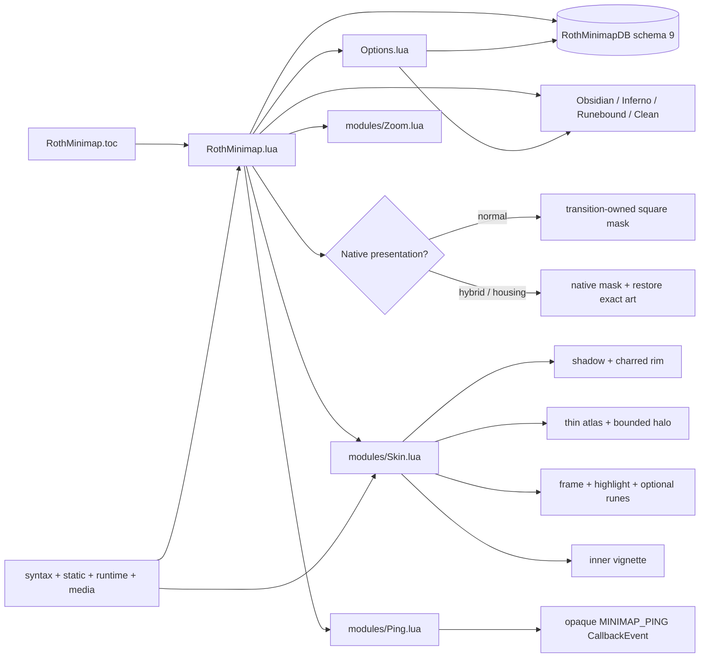

# Roth Minimap code graph — 0.5.0

```mermaid
flowchart LR
  TOC["RothMinimap.toc"] --> CORE["RothMinimap.lua"]
  CORE --> DB[("RothMinimapDB schema 9")]
  CORE --> PRESET["Obsidian / Inferno / Runebound / Clean"]
  CORE --> MODE{"Native presentation?"}
  MODE -->|normal| MASK["transition-owned square mask"]
  MODE -->|hybrid / housing| FALLBACK["native mask + restore exact art"]
  CORE --> SKIN["modules/Skin.lua"]
  SKIN --> DEPTH["shadow + charred rim"]
  SKIN --> EMBER["thin atlas + bounded halo"]
  SKIN --> FRAME["frame + highlight + optional runes"]
  SKIN --> VIGNETTE["inner vignette"]
  CORE --> PING["modules/Ping.lua"]
  PING --> CALLBACK["opaque MINIMAP_PING CallbackEvent"]
  CORE --> ZOOM["modules/Zoom.lua"]
  CORE --> OPT["Options.lua"]
  OPT --> PRESET
  OPT --> DB
  TESTS["syntax + static + runtime + media"] --> CORE
  TESTS --> SKIN
```

No edge grants ownership of `MinimapCluster`, `MinimapBackdrop`, Hybrid Minimap, MapCanvas masks, housing overlays, or third-party buttons.
